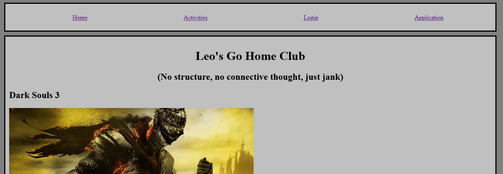

# Homework #3 Solution
**Hui Lin**

**NetID: ti2236**

## Question 1
## (a)

## (b)

## (c)


## Question 2
## (a)

## (b)
``` html
<nav>
    <ul>
        <li><a href="index.html">Home</a></li>
        <li><a href="club_activities.html">Activities</a></li>
        <li><a href="login.html">Login</a></li>
        <li class="active"><a href="application.html">Application</a></li>
    </ul>
</nav>
```

## Question 3
## (a)
``` html
<main>
    <form>
        <header>
            <h1>Login</h1>
        </header>
        
        <label>Email</label>
        <input id="email" type="email"></input>

        <label>Password</label>
        <input type="password"></input>

        <button id="login_button">Login</button>
    </form>

    <p id="message"></p>
</main>
```

## (b)
``` javascript
<script>
    let email_address = document.getElementById("email");
    document.getElementById("login_button").addEventListener("click", myEvent);

    function myEvent()
    {
        event.preventDefault();

        let message = document.getElementById("message");
        message.innerHTML = "Welcome, " + email_address.value + ", this site is currently under construction";
        message.classList.add("message_style");
    }
</script>
```

## Question 4
## (a)
``` html
<form>
    <header>
        <h1>Application</h1>
    </header>
    
    <label>Name</label>
    <input id="application_name" type="name" minlength="1" maxlength="100" required></input>

    <label>Email</label>
    <input id="application_email" type="email" minlength="5" maxlength="100" required></input>

    <label>Password</label>
    <input id="application_password" type="password" minlength="8" maxlength="100" required></input>

    <select id="newsletter">
        <option>Annoy me with newsletters</option>
        <option>Please don't</option>
    </select>

    <button id="signup_button">Sign Up</button>
</form>
```


## (b)


## (c)
``` css
.signup_summary_style
{
    border: 5px solid;
    border-color: green;
    padding: 10px;
    text-align: center;
}

.show
{
    margin-left: 0px;
    height: 100px
}

.hide
{
    margin-left: -5000px;
    height: 0px;
}
```

```javascript
<script>
    let name = document.getElementById("application_name");
    let email_address = document.getElementById("application_email");
    let newsletter = document.getElementById("newsletter");
    document.getElementById("signup_button").addEventListener("click", myEvent);

    function myEvent()
    {
        event.preventDefault();

        let dialog = document.getElementById("ThanksDialog");
        dialog.classList.remove("hide");
        dialog.classList.add("show");

        let summary = document.getElementById("signup_summary");
        summary.innerHTML = "Name: " + name.value + " Email address: " + email_address.value + " Newsletters: " + 
                            newsletter.value;
        dialog.classList.add("signup_summary_style");

        let button = document.createElement("button");
        button.innerHTML = "Close";
        message.appendChild(button);
    }
</script>
```

## Question 5
https://csweb01.csueastbay.edu/~ti2236/clubProject/index.html