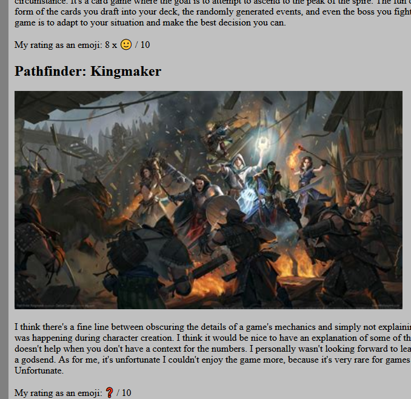
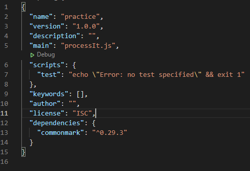
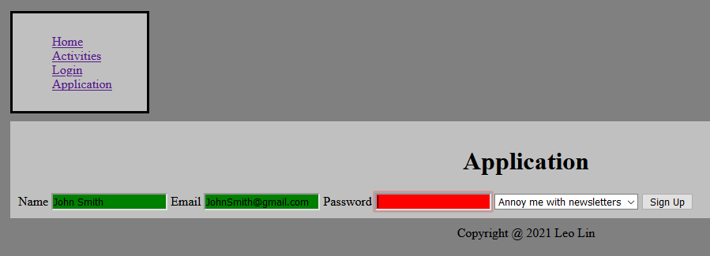

# Homework #3 Solution
**Hui Lin**

**NetID: ti2236**

## Question 1
## (a)
* index.html


## (b)
* Smile: 128578
* Question mark: 10067


## (c)
``` css
nav ul li
{
    list-style-type: none;
}
```

## Question 2
## (a)
## (b)

## (c)
``` css
table
{
    border-collapse: collapse;
    border: 2px solid;
}

td, th
{
    border: 1px solid;
    padding: 10px;
    text-align: center;
}
```


## Question 3
## (a)

## (b)
http://csweb01.csueastbay.edu/~ti2236/clubProject/index.html

## Question 4
## (a)
1. tokenizes the sentence with space as the delimiter
2. appends "far", "far", and "away" to the list
3. replaces the space between each word with "_"
4. returns the index of "galaxy" in the list
5. yes, "college" replaced "galaxy"
6. pops the top of the list, which is "away"


## (b)
1. take an, assumed, string and return a copy of the string all in uppercase
2. calls upper() on every element of myArray2 and return the result to be stored in myArray3
3. they're turned to lower case so their ascii code can be compared, and they can be sorted lexically
4. sort() will first call noCaseSort() and then sort based on the result returned from it
## (c)
1. because there're multiple entries
2. yes, the courses are an array of strings
3. 0
4. Notepad++, VS Code, CLion

