# Homework #2 Solution
**Hui Lin**

**NetID: ti2236**

## Question 1
## (a)
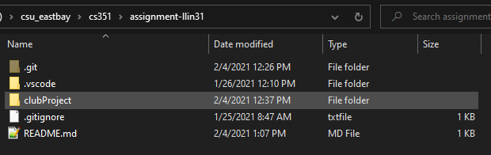
## (b)
    1. no
    2. no
    3. no

    index.html
    club_activities.html
## (c)
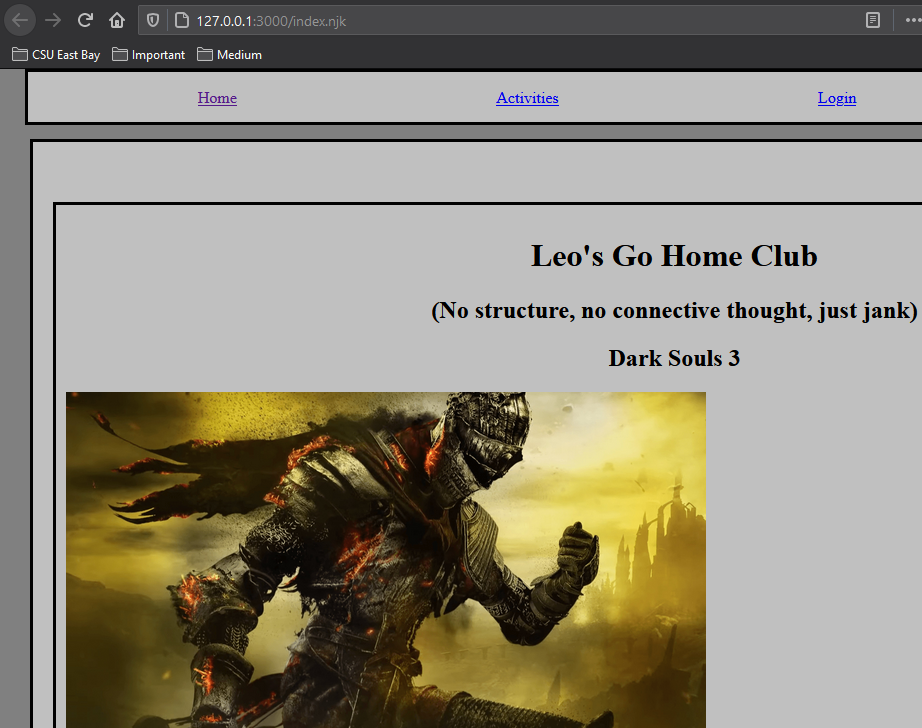
## (d)
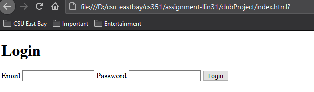
## (e)
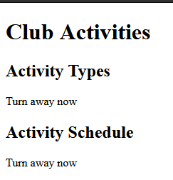

## Question 2
## (a)
    we should nest <header> outside <main> and inside <body> to serve an introductory content for the whole page
## (b)
    we should nest <footer> outside <main> and as the last item in <body> because the copyright info shouldn't be in <main>
## (c)
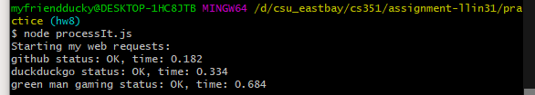
## (d)
```html
<!DOCTYPE html>
<html lang="en">
    <head>
        <title>Add title here</title>
    </head>

    <body>
        <header>
            <h1>Add header here</h1>
        </header>

        <nav>
            <ul>
                <li class="active"><a href="index.html">Home</a></li>
                <li><a href="club_activities.html">Activities</a></li>
                <li><a href="login.html">Login</a></li>
            </ul>
        </nav>

        <main>
            <h1>The Big Club</h1>

            <h2>It's a big club, and you ain't in it</h2>
            <p>
                Some explanatory text
            </p>

            <h2>About Dark Souls</h2>
            <p>
                Dark Souls is a video game           
            </p>

            <h2>Gameplay</h2>
            <p>
                Fun derived from challenging gameplay
            </p>
        </main>

        <footer>Copyright @ 2021 Leo Lin</footer>
    </body>
</html>
```

## Question 3
## (a)
    1. "hello" is a string, not an int, NaN means "not a number"
    2. parse everything before the first char as int if possible
    3. parse the first 2 things as int if possible
    4. no, because it stops parsing after reading 'h'
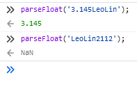
## (b)
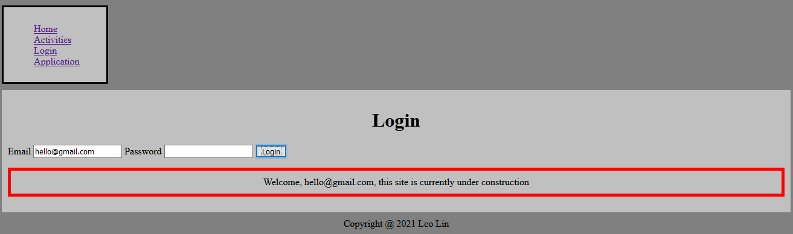
## (c)
    1. yes
    2. "'It'" is closed between a pair of '', but there isn't a second pair of '' to close everything after it, so an error occurs
    3. '\' indicates the next character should be treated specially, so the ' will be treated as part of the string
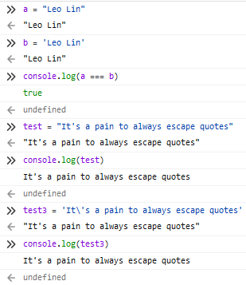
## (d)
    1. store every char in name as uppercase in uname
    2. store every char in name as lowercase in lname
    3. they check if the uname/lname includes 'A'/'i'
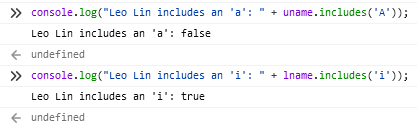
## (e)
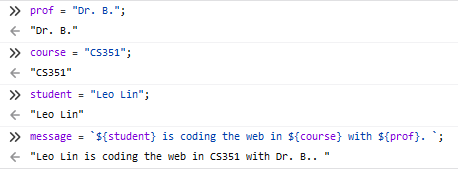
## Question 4
## (a)
    Times New Roman
## (b)
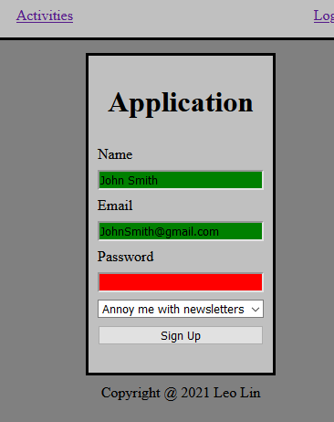
## (c)

## (d)
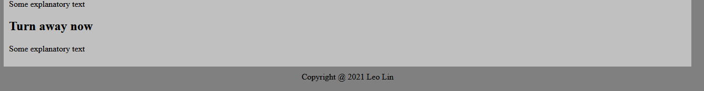
```css
header
{
    font-family: "Times New Roman", "seriff";
    text-align: center;
}

body
{
    background-color: gray;
    margin: 10px;
    padding: 10px;
}

nav
{
    background-color: silver;
    margin: 10px;
    padding: 10px;
    max-width: 150px;
    border-style: solid;
}

nav > ul li
{
    list-style-type: none;
}

main
{
    background-color: silver;
    margin: 10px;
    padding: 10px;
}

ul li:active
{
    background-color: white;
}

footer
{
    text-align: center;
}
```